# 客戶服務分析與優化（Excel）

Image by <a href="https://pixabay.com/users/geralt-9301/?utm_source=link-attribution&utm_medium=referral&utm_campaign=image&utm_content=8643475">Gerd Altmann</a> from <a href="https://pixabay.com//?utm_source=link-attribution&utm_medium=referral&utm_campaign=image&utm_content=8643475">Pixabay</a>

## 目錄
* 專案概述
* 資料來源
* 工具使用
* 商業問題
* 資料探索及清洗
* 資料分析
* 儀表板建立
* 結論
* 建議
* 限制說明
* 其他想法
* 參考資料

## 專案概述
&nbsp;&nbsp;&nbsp;&nbsp;&nbsp;&nbsp;為了解企業客服中心（Call Center）提供客戶詢問服務之情形，因此使用 Microsoft Excel 探索客服詢問數，滿意度，客戶服務管道，客戶情緒表現，客服回應時間，詢問案件類型等數據指標，回答相關商業問題，以提供業務決策建議。此外，建置儀表板供客服部門使用，進而提升客服效率及客戶滿意度。

&nbsp;&nbsp;&nbsp;&nbsp;&nbsp;&nbsp;分析結果發現客戶的情緒表現直接反應在滿意度上面，即情緒表現為正面的顧客給予較高的滿意度分數，反之則較低分。針對客戶情緒表現為負面（Negative 及 Very Negative）的兩群樣本中，發現客戶詢問的問題皆是 Billing Question 類型的問題較多，因此進一步確認了是源於總樣本中 Billing Question 的佔比本身就較高（超過70%），而這部份的問題主要是帳單錯誤、費用疑問等問題，因此基於80/20法則，會建議公司相關業務部門加以確認於帳單的處理環節上是否有疏忽的地方，亦或是公司對外的網站上提供的帳單計費方式等資訊不夠清楚。

&nbsp;&nbsp;&nbsp;&nbsp;&nbsp;&nbsp;了解不同客戶服務管道下的使用佔比及滿意度等指標情形，有助於了解客戶需求及做為公司預算分配的決策指引。分析公司目前的4種客戶服務管道下的情形，發現在詢問佔比上，客戶最常使用的管道為 Call-Center 及 Chatbot，佔比分別為32.3%及25.1%，兩者的共同點為提供"即時"詢問，而佔比較低的管道為 Email 及 Web，共通點為"非即時"詢問，因此可以初步判斷多數的客戶對客服的需求傾向以"即時"服務為主；而在客戶滿意度上，各種服務管道的差別不大，平均分數均落在約5.4分至5.7分之間。考慮到人力成本的與日俱增，在確保滿足客戶的"即時"服務需求的前提下，會建議相關部門提升在 Chatbot 管道的挹注資源，增進客戶服務體驗，也能減少客服等待時間，進而降低人力成本，同時透過持續監控各管道下的滿意度等數據指標來反饋成效，以持續調整優化決策。

&nbsp;&nbsp;&nbsp;&nbsp;&nbsp;&nbsp;在一段時間內接到超過多少客服詢問數時，可能導致客服等待時間超過公司承諾的服務水平，而使得公司期待將某個負面指標控制在幾%以下的目標失敗？若能知道在未來的一段時間內會有多少客服詢問數，公司就能精準配置客服人力，降低人力成本，並控制住負面指標。由於資料源僅提供到以"天"為單位的時間特徵，未提供更細顆粒度的時間資料（幾時幾分幾秒），因此這個部分主要提供每日客服詢問數及客服回應時間水準資訊供參考。從整體樣本中觀察到每日客服詢問數平均值為1,098，而客服回應時間落在 Below SLA 水準的約佔24.7%，也就是每4個顧客中，大概會有1位須等待較長時間才能聯絡上客服。直觀上，隨著客服詢問數的增加，會導致客服回應時間拉長，意即兩者之間應該是正相關，而從觀察到的結果也確實如此，只是兩者的趨勢變化沒到非常重合，原因大概是目前涵蓋的是所有客戶服務管道下的樣本，意即當中也包含了"非即時"服務。因此，我們另外單獨看以提供"即時"服務的 Call-Center 管道下的趨勢變化，發現正相關性確實較高，即更能反應隨著客服詢問數增加，使客服回應時間拉長，其中每日客服詢問數平均值為355，而客服回應時間落在 Below SLA 水準的約佔25.11%。此部分會建議客服部門先訂定期望達成的績效指標，例如追求下個月在"即時"服務的 Call-Center 管道下達成 Below SLA 的佔比低於25.11%，因此在總人力使用時數不變的前提下，透過建模預測每日客服詢問數，若高於355則在當日增加客服人力，反之則減少人力，並在下個月結束以後檢視是否達成該指標績效，以驗證該決策是否有效。

&nbsp;&nbsp;&nbsp;&nbsp;&nbsp;&nbsp;掌握公司各據點的客服中心所接到的客服詢問數以及客戶所在地區的客服詢問數，或許能為公司未來的據點設立在決策上提供參考。目前公司客服中心坐落於4個州，各州的據點所接到的客服數由大到小依序為：California，Maryland，Illinois，Colorado，其中最多的 California 共計13,734筆，其次 Maryland 共計11,012筆。而客戶所在地區的客服詢問數統計前四名依序為：California，Texas，Florida，New York，其中最多的 California 共計 3,630筆，其次 Texas 共計3,572筆，這部分影響多寡的主要原因大概就只是美國人口數最多的前幾個州。另外也分析了客戶所在位置與客服中心的距離是否會影響客服等待時間，結果顯示距離並未影響等待時間。

&nbsp;&nbsp;&nbsp;&nbsp;&nbsp;&nbsp;透過上述分析結果來回答重要的商業問題，並建議公司相關部門優先針對相關問題加以檢討並優化相關業務流程及內容。後續將持續監測各指標變化，以了解相關決策成效，並優化決策依據，進而提升客服效率及客戶滿意度。

## 資料來源
* 資料來源：[#RWFD - Call Centers](https://sonsofhierarchies.com/real-world-fake-data/)
* 資料期間：2020年10月1日至2020年10月30日（排除2020年10月31日，因資料未統計到當日結束，資料源僅1筆資料）
* 資料筆數：32,940筆
* 警告：資料是作者提供Tableau社群夥伴針對不同行業的業務發展提供分析靈感所建立的虛假資料，並非真實的資料

## 工具使用
* Microsoft Excel 2019（Pivot tables, charts, formulas, conditional formatting, data cleaning, etc.）

## 商業問題
* 影響客戶滿意度的原因?
* 客戶最常問哪種類型的問題?
* 各種客戶服務管道下的詢問佔比，滿意度及問題類型如何?
* 客服回應客戶的時間多快?
* 在一段時間內接到多少客服詢問數時，可能導致客服等待時間拉長?
* 各據點的客服中心所接到的客服詢問數? 客戶所在地區的客服詢問數?
* 是否有因為客戶所在的州距離客服中心較遠而使客服等待時間較長?

## 資料探索及清洗
進入分析前，須先了解每個資料欄位（特徵）的意義並觀察資料是否有重複,缺失,異常等情形，並思考特徵之間的可能關係，以及哪些可能是影響業務決策的關鍵指標，甚至進一步想到配合業務情境可能的建模需求（非必要）。有了上述的觀察與頭腦風暴後，接著就進行資料清洗，目標是排除上述提到的資料情形，使同欄位的資料格式趨於一致，並從原有的特徵中建立新的特徵欄位。

原始資料：[CallCenter_RawData](Data/CallCenter_RawData.xlsx)

根據上述的說明，進行資料探索及清洗的部分如下：
1. 備份原始資料 （很重要!!!）
2. 了解資料欄位
3. 刪除重複值：0筆（無重複資料）
4. 資料缺失情形：整體資料算完整，僅觀察到客戶滿意度欄位（csat_score）有缺失，佔比約62.8%（20,669筆/32,940筆）；此部分考量後續尚無建模需求且希望保留其他欄位資訊，故無針對此特徵進行相關處理（如補值，刪除整個Row）
5. 清洗資料及創建新欄位：
    - 處理日期欄位（call_timestamp）以辨識正確日期，以利後續分析時間趨勢
    - 從客服中心位置欄位（call_center）取出"州"的簡寫並透過對應取得"州"的全名，並新增欄位，以利後續製作地圖上辨識位置時較不容易出現問題（Excel在”州”的簡寫上容易辨識不到地圖上的位置）

 **函式使用**

**清洗後資料**
  

## 資料分析
此部分將分析數據指標並回答上述商業問題：（提醒：當陷入過度分析時要回頭檢視商業目標） 

### 影響客戶滿意度的原因?
客戶情緒很直觀的反應在滿意度上面，即情緒表現為正面的顧客給予較高的滿意度分數，反之則給予較低分。其中在客服總詢問數中，客戶表現出負面情緒（Negative + Very Negative）佔比超過一半（約51.9%）。（如圖一）

針對客戶情緒表現為負面（Negative 及 Very Negative）的樣本中，發現在客戶詢問問題類型上，皆是 Billing Question 類型的問題較多（如圖二），因此想進一步確認是否源於總樣本中 Billing Question 的佔比本身就較高，這部分經證實確實如此（如圖三）。Billing Question 一般主要是帳單錯誤、費用疑問等問題（原始資料僅提供較大類別的問題類型，若能得到顆粒度更細的欄位資料，就能了解更精確的問題類型，給出更明確的分析建議），因此針對這部分會回饋給公司相關業務部門加以確認於帳單的處理上是否有疏忽的地方，亦或是公司對外的網站上提供的帳單計費方式等資訊不夠清楚。 
 (圖一) 
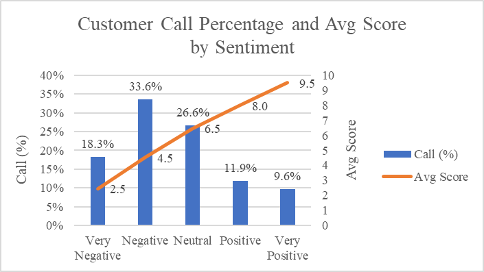 

註1：資料統計期間: 2020年10月1日至2020年10月30日 
註2：橫軸以顧客情緒表現由負面到正面程度依序排列 

 (圖二) 
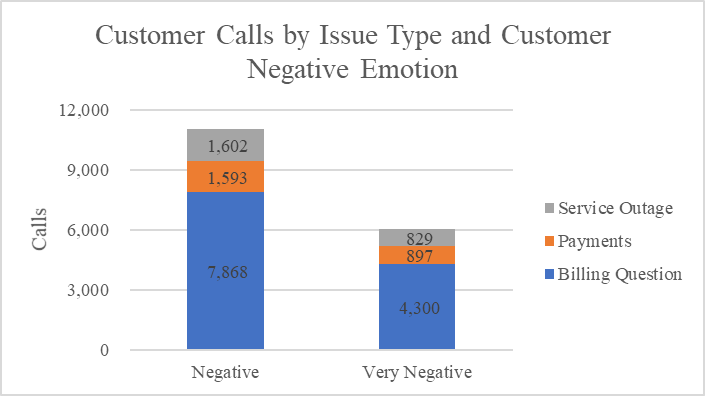 

註1：資料統計期間: 2020年10月1日至2020年10月30日 
註2：另外確認了在正面情緒表現的樣本上反應的問題類型，發現也是 Billing Question 較多 
註3：另外分別做了有負面情緒表現的客戶及正面情緒表現的客戶之下，其他特徵（如客服回應時間，客服所在據點，客戶詢問案件類型，客戶服務管道）的資料分佈情形，並沒有發現較具顯著差異的情況，意即難以從現有資料中辨識出影響客戶有不同情緒表現的主要原因  

### 客戶最常問哪種類型的問題?
最高為 Billing Question，佔比約71.2%。基於80/20法則，建議公司相關部門應該優先針對這部分的問題加以檢討並優化相關業務流程及內容，後續將持續監測該指標的變化，並反饋優化後的成效。（如圖三） 
 (圖三) 
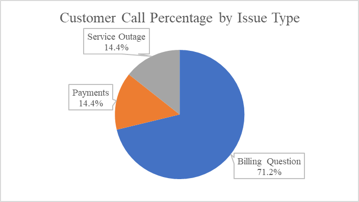 

註1：資料統計期間: 2020年10月1日至2020年10月30日 
註2：橫軸以顧客情緒表現由負面到正面程度依序排列  

### 各種客戶服務管道下的詢問佔比，滿意度及問題類型如何?
目前公司的客戶服務管道有4種，包含如下：Call-Center，Chatbot，Email，Web 
* 以詢問佔比而言，客戶最常使用的管道為 Call-Center 及 Chatbot，佔比分別為32.3%及25.1%，兩者的共同點為提供"即時"詢問；而客戶較少使用的管道為 Email 及 Web，共通點為"非即時"詢問。因此可以初步判斷，大部份的客戶對客服的需求傾向以"即時"服務為主。
* 以客戶滿意度而言，在4種服務管道下的差別不大，平均分數落在約5.4分至5.7分之間。（如圖四）
* 以各種客戶服務管道下的客戶詢問問題來說，發現在 Call-Center 管道上獨有的問題是 Payments，但沒有的問題是 Service Outage；對比其他三個管道上則是沒有 Payments，而有 Service Outage。對於上述的數據發現，若以真實世界的情況來說會有點違反常理，因為正常人若遇到 Service Outage（服務中斷）的情況，通常第一反應就是打電話到 Call Center 了解情況及尋求幫助，不至於該管道上會沒有這類型的詢問問題，當然也有一些可能的原因，像是該公司有專門處理服務中斷問題的技術支援熱線，因此相關問題沒有流向 Call Center 管道，或是不計入該管道。（如圖五）

此部分需與業務單位了解為何 Payments 的問題只出現在 Call-Center 管道，需釐清問題類型的實際定義。另外，考慮到人力成本的與日俱增，在確保滿足客戶的"即時"服務需求的前提下，會建議相關部門提升在 Chatbot 管道的挹注資源，增進客戶服務體驗，也能減少客服等待時間，並進而減少人力成本，同時透過持續監控各管道下的滿意度等數據指標來反饋成效，以持續調整優化決策。 
 (圖四) 
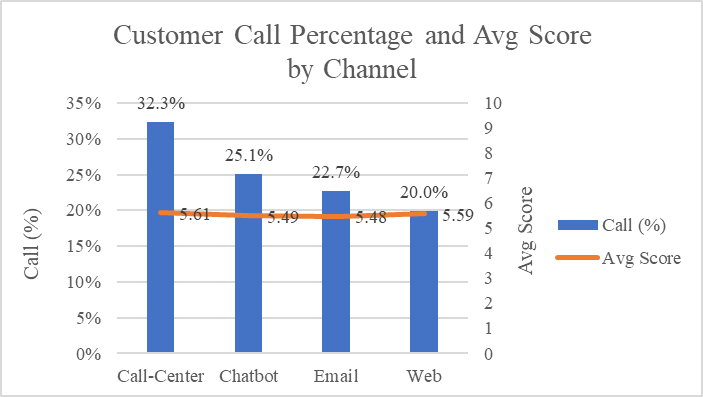 

註：資料統計期間: 2020年10月1日至2020年10月30日 

 (圖五) 
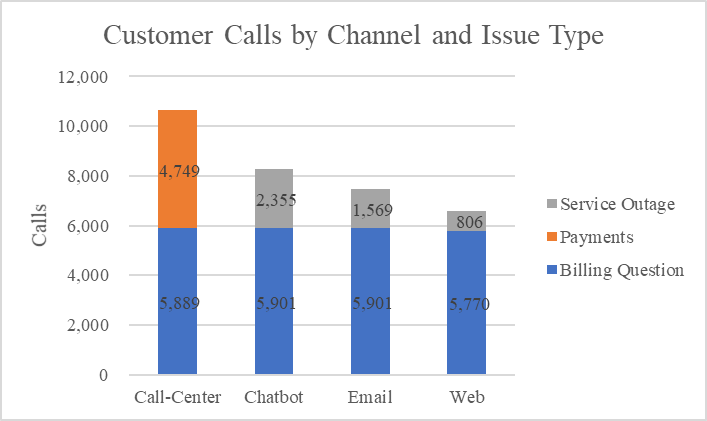 

註：資料統計期間: 2020年10月1日至2020年10月30日  

### 客服回應客戶的時間多快?
在資料集中有關客服等待時間的部份，並未提供實際的數字，而是提供 SLA（Service-Level Agreement），俗稱服務級別協定，意思是服務提供商與客戶之間定義的承諾，服務提供商承諾達成某種程度的服務水平，而其中分成三個級別，包含 Above SLA，Within SLA，Below SLA，分別代表服務商的表現優於承諾水準，接近承諾水準，低於承諾水準。（詳見[維基百科](https://en.wikipedia.org/wiki/Service-level_agreement)）

從整體樣本中觀察到客服回應時間落在 Below SLA 水準的約佔24.7%，也就是每4個顧客中，大概會有1位須等待較長時間才能聯絡上客服；而回應時間落在 Within SLA 水準的佔比超過6成，說明有過半客戶的等待時間落在正常水準，不算快也不算慢。（如圖六） 
 (圖六) 
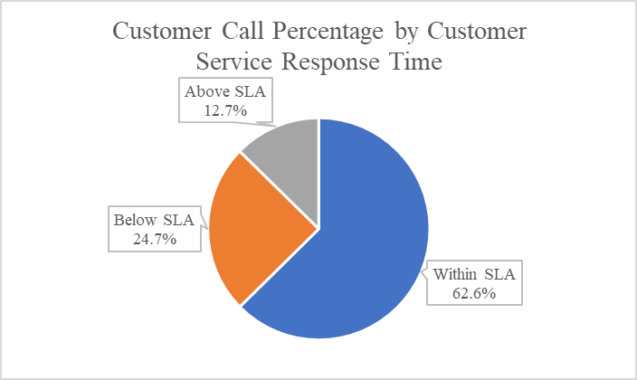 

註1：資料統計期間: 2020年10月1日至2020年10月30日 
註2：另外統計了在三種客服回應時間水準下的客戶滿意度，發現平均分數沒有明顯差異，這從常理上來想算是合理，畢竟多數客戶給予滿意度高低主要是看客服能否解決當下提出的問題以及客服的態度等等較為實際的因素  

### 在一段時間內接到多少客服詢問數時，可能導致客服等待時間拉長?
若能知道在一段時間內大概會有多少客服詢問數，公司就能合理的配置客服人力，提升客戶服務效率。一般來說，若是資料中能提供到更細的時間顆粒度（幾時幾分幾秒），就能得到更小時間範圍的客服詢問數，然此資料集僅提供到以"天"為單位的時間欄位，因此這個部份只分析到每日的客服詢問數。
* 每日客服詢問數落在約1,000至1,200之間（每日平均值為1,098），而客服回應時間落在 Below SLA 水準的佔比落在約20%至30%之間（每日平均值為24.7%）。直觀上，隨著客服詢問數的增加，會導致客服回應時間拉長，意即兩者之間應該是正相關，而從圖上的觀察也確實如此，只是兩者的趨勢變化沒到非常重合，原因大概是目前涵蓋的是包含了所有客戶服務管道下的樣本（Call-Center，Chatbot，Email，Web），意即當中也包含了"非即時"服務。（如圖七）
* 我們想另外單獨看以提供"即時"服務的 Call-Center 管道下的趨勢變化（雖然 Chatbot 也是提供"即時"服務，但觀察在此管道下的客服詢問數與回應時間的關係沒啥意義）。結果如下圖，發現正相關性確實較高，即更能反應隨著客服詢問數增加，使客服回應時間拉長，其中每日客服詢問數落在約300至450之間（每日平均值為355），而客服回應時間落在 Below SLA 水準的佔比介於15%至35%之間（每日平均值為25.11%）。（如圖八）

此部分主要提供每日客服詢問數及客服回應時間水準資訊供參考，畢竟要能在事前預判一段時間內會有多少客服詢問數，需要考慮到很多面向，像是近期公司是否有新功能上線，新產品推出等因素，因此若能將更多面向的業務數據納入分析，就能提供具體的行動建議。實務上，應該先與公司團隊討論期望達成的目標為何，例如追求下個月在"即時"服務的 Call-Center 管道下達成 Below SLA 的每日佔比平均值落在25.11%以下，因此在總人力使用時數不變的前提下，透過建模預測每日客服詢問數，若高於355則在當日增加客服人力，反之則減少人力，並在下個月結束以後檢視是否達成該指標績效，以驗證該決策是否有效。 
 (圖七) 
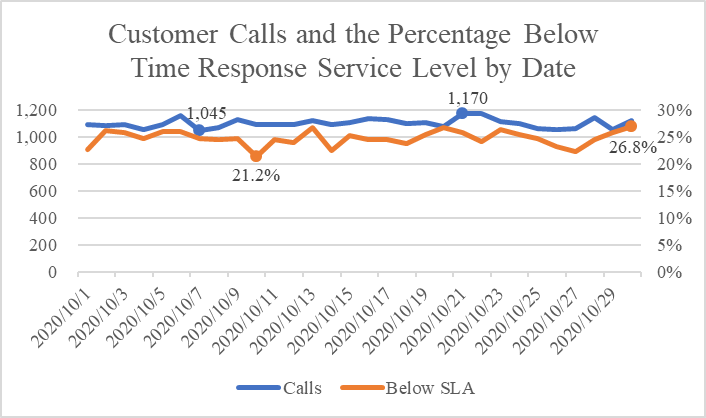 

註1：資料統計期間: 2020年10月1日至2020年10月30日 
註2：為避免造成圖表難以辨識，故未將每個資料點皆顯示數字標籤，僅呈現最大值和最小值供辨識範圍區間 

 (圖八) 
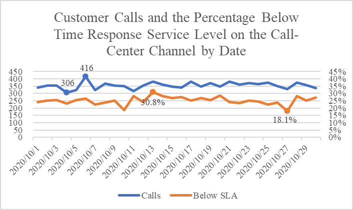 

註1：資料統計期間: 2020年10月1日至2020年10月30日 
註2：為避免造成圖表難以辨識，故未將每個資料點皆顯示數字標籤，僅呈現最大值和最小值供辨識範圍區間  

### 各據點的客服中心所接到的客服詢問數? 客戶所在地區的客服詢問數?
目前客服中心坐落於4個州，各州的據點所接到的客服數由大到小依序為：California，Maryland，Illinois，Colorado，其中最多的 California 共計13,734筆，其次 Maryland 共計11,012筆。（如圖九）

而客戶所在地區的客服詢問數統計前四名依序為：California，Texas，Florida，New York，其中最多的 California 共計 3,630筆，其次 Texas 共計3,572筆。這部分影響多寡的主要原因大概就只是美國人口數最多的前幾個州（參考[United States Census Bureau](https://www.census.gov/popclock/)）。（如圖十） 
 (圖九) 
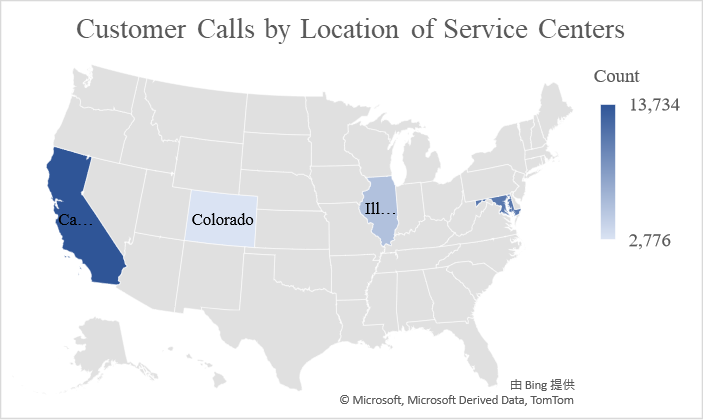 

註：資料統計期間: 2020年10月1日至2020年10月30日 

 (圖十) 
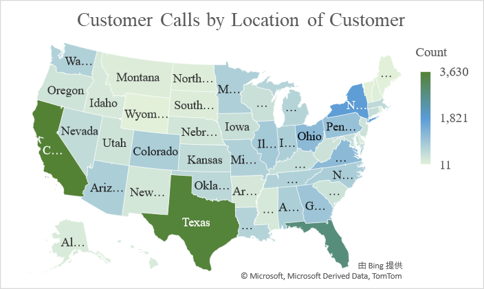 

註：資料統計期間: 2020年10月1日至2020年10月30日  

### 是否有因為客戶所在的州距離客服中心較遠而使客服等待時間較長?
客服等待時間看起來沒有因客戶所在的州距離客服中心較遠而較長，其中發現 Wyoming 的 Below SLA 水準比例較高，約45.5%，判斷可能原因為該州的樣本數較少（僅11筆客服詢問數，是全美中筆數最少的州），因此每筆等待時間對 Below SLA 水準比例的影響都較大。（如圖十一） 
 (圖十一) 
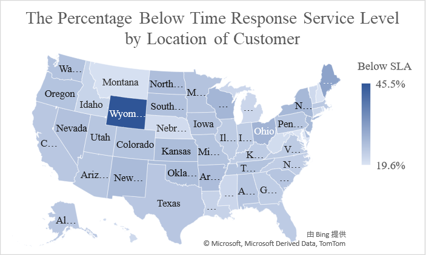 

註：資料統計期間: 2020年10月1日至2020年10月30日  

## 儀表板建立
儀表板的內容主要是從客服詢問數及客戶滿意度的角度出發，提供相關業務部門快速掌握在客服管道，客戶情緒表現，客戶詢問問題，客服據點等特徵的趨勢變化情形，並提供了不同特徵之間的交互關係，另外也在儀表板左側提供篩選器，供使用者的分析需求自行設定。期望透過儀表板的追蹤發現公司問題，進而改進以提升客服效率及客戶滿意度。[[檔案連結](https://github.com/ThomasTsao47/Call_Center_Project/tree/main/Files)]

## 結論
* 為了解企業客服中心（Call Center）提供客戶詢問服務之情形，因此使用 Excel 探索客服詢問數，滿意度，客戶服務管道，客戶情緒表現，客服回應時間，詢問案件類型等數據指標，回答相關商業問題，以提供業務決策建議
* 客戶的情緒表現直接反應在滿意度上面，而客戶最常詢問的問題通常與 Billing Question 有關
* 從分析公司的4種客戶服務管道下的使用情況中，發現客戶對即時服務的需求較高，主要是在 Call-Center 和 Chatbot 管道
* 透過對客服詢問數和等待時間的分析，我們能更精確地配置人力資源，以控制客服等待時間
* 我們研究了公司各據點的客服情況，對未來的據點設立在決策上提供了參考

## 建議
* 建議公司相關部門優先確認並優化與 Billing Question 相關的業務流程和內容，如帳單的處理環節，亦或是公司對外的網站上提供的帳單計費方式等資訊，以減少多數的客服問題
* 在確保滿足客戶的"即時"服務需求的前提下，會建議相關部門提升在 Chatbot 管道的挹注資源，以減少客服等待時間，進而降低人力成本
* 建議設定目標績效指標，並根據預測的詢問數調整人力配置，以減少客服等待時間
* 公司應持續監測各指標的變化，以優化決策依據，提升客服效率及客戶滿意度

## 限制說明
* 由於是虛假資料，分析的結果可能不見得符合真實世界的情況，我只能盡可能以真實世界的角度去解釋較為合理的數據發現
* 客服詢問數及詢問案件類型的變化反應了公司業務面的問題，而資料源僅提供客服方面的資料，能做的分析有限，且資料期間較短，無法反應長期的趨勢變化

## 其他想法
直覺上可能認為客服詢問數隨時間演進呈現下降趨勢是件好事，因為可能代表公司的產品,業務面都做得很好，所以客戶沒有遇到甚麼問題，但也許真實情況是產品太爛，導致用戶流失不用了，自然客服詢問數就會下降。此外，在實務上因為公司隨業務發展會調整營業模式及推出不同的產品，因此客服的詢問也會遇到不同以往的問題，所以在分析上需要搭配產品及用戶使用等多種數據源來加以驗證及判斷真實的情況為何，才能提供更為客觀的決策建議。因此在客服層面上，目標不應該是追求總客服詢問數的下降，或許追求減少人工客服並提升數位客服的使用，及客戶滿意度在長期的穩定提升應該較為適當。

## 參考資料
1. transcosmos
   - 標題：傳統Call Center客服中心跟Contact Center聯絡中心的差異?
   - 網址：[https://rb.gy/o2jnwv](https://rb.gy/o2jnwv)
2. Wikipedia
   - 標題：Service-level agreement
   - 網址：[https://en.wikipedia.org/wiki/Service-level_agreement](https://en.wikipedia.org/wiki/Service-level_agreement)
3. United States Census Bureau
   - 標題：U.S. and World Population Clock
   - 網址：[https://www.census.gov/popclock/](https://www.census.gov/popclock/)
